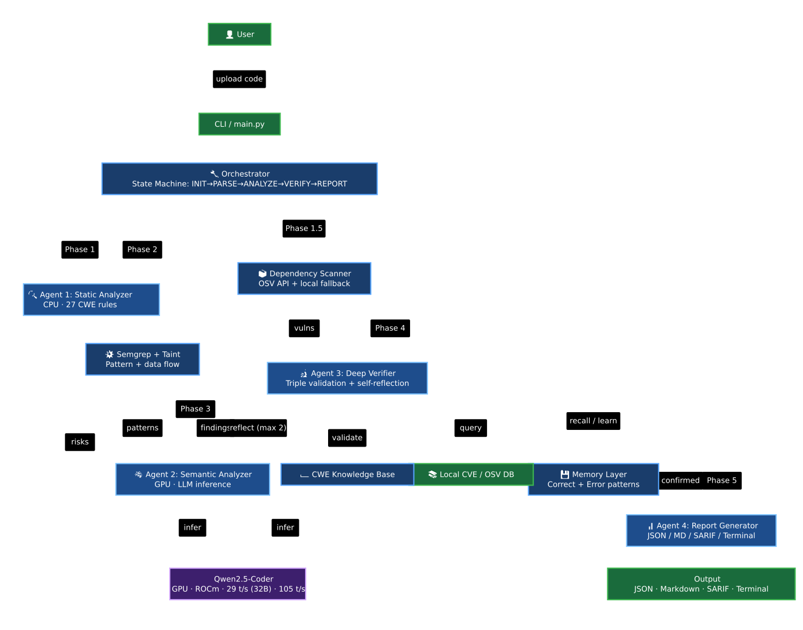

# CodeRisk Agent 🛡️

**AI-Powered Code Security Analysis — Running Entirely on Your Local AMD GPU**

> Semgrep finds known patterns. CodeRisk Agent understands logic, traces attack paths, and provides exploitability evidence — with LLM inference running entirely on your local AMD GPU. All vulnerability knowledge bases (CWE, CVE, OSV) are bundled locally. No external API calls at runtime.

[](https://www.python.org/downloads/)
[](LICENSE)
[](https://rocm.docs.amd.com/)

---

## Why CodeRisk Agent?

Enterprises need AI-powered code security, but **cannot upload source code to cloud services**. Compliance (HIPAA, GDPR), intellectual property, and corporate policy all prohibit it.

CodeRisk Agent solves this: **deep AI analysis running 100% locally on AMD Radeon GPUs**. Code never leaves the machine.

| Feature | Semgrep | Cloud AI (Copilot) | **CodeRisk Agent** |
|---------|---------|--------------------|--------------------|
| Local execution | ✅ | ❌ | ✅ |
| Understands code logic | ❌ | ✅ | ✅ |
| CVE/NVD integration | ❌ | ❌ | ✅ |
| Self-learning memory | ❌ | ❌ | ✅ |
| Evidence chain | Pattern only | Black box | **Full traceability** |

---

## Architecture




```
User uploads code
        ↓
┌───────────────────┐
│    Orchestrator    │  State machine: INIT → PARSE → ANALYZE → VERIFY → REPORT
└───────┬───────────┘
        ↓
┌───────┴────────┐
│                │
↓                ↓
Agent 1         Agent 2          ← Parallel execution
Static Analyzer  Semantic Analyzer
(CPU + tools)    (GPU + LLM)
│                │
└───────┬────────┘
        ↓
    ┌───┴───┐
    │ Self- │  ← Agent 3 flags missed risks, triggers re-analysis
    │Reflect│
    └───┬───┘
        ↓
    Agent 3                     ← Triple cross-validation
    Deep Verifier               (Tool + Knowledge Base + Local CVE DB)
    (GPU + LLM + Local DB)
        ↓
    Agent 4                     ← Structured reports
    Report Generator            (JSON + Markdown + Terminal)
        ↓
  ┌─────────────┐
  │ Memory Layer │  Correct memory + Error memory
  │  (JSON)      │  "Learns" from every scan
  └─────────────┘
```

### The 4 Agents

| Agent | Role | Compute | What It Does |
|-------|------|---------|--------------|
| **Agent 1: Static Analyzer** | Pattern matching | CPU | 27 detection rules (buffer overflow, format string, double free, command injection, etc.) |
| **Agent 2: Semantic Analyzer** | LLM-driven analysis | GPU | Validates findings, discovers missed vulnerabilities, generates attack scenarios |
| **Agent 3: Deep Verifier** | Triple cross-validation | GPU + CPU | CWE knowledge base + local CVE database + self-reflection loop |
| **Agent 4: Report Generator** | Output formatting | CPU | JSON, Markdown, Rich terminal with CWE/CVE clickable links |

### What Makes It Different

- **Triple Cross-Validation** — Tool confirmation + CWE knowledge base + local CVE database query
- **Self-Reflection Loop** — Agent 3 asks "Did we miss anything?" and re-analyzes
- **Dual Memory** — Correct patterns boost confidence; error patterns suppress false positives
- **Evidence Chain** — Every risk has source code snippet, CWE classification, and reasoning

### Layered Analysis Strategy

CodeRisk Agent uses a 4-layer analysis approach:

| Layer | Component | Dependency | Role |
|-------|-----------|-----------|------|
| Layer 1 | 27 built-in rules | None (self-contained) | Core CWE coverage, always available |
| Layer 2 | Semgrep integration | Optional | Extended pattern matching (1000+ rules) |
| Layer 3 | LLM semantic analysis | GPU required | Understands code logic, finds logical vulnerabilities |
| Layer 4 | Three-way cross-validation | All layers | Eliminates false positives via tool + KB + CVE confirmation |

**Without Semgrep:** Layer 1 + 3 + 4 still form a complete analysis pipeline.

**With Semgrep:** Layer 2 adds breadth, but CodeRisk Agent's core value (semantic understanding + cross-validation) is independent of Semgrep.

### Memory System

CodeRisk Agent learns from previous scans to improve accuracy:

- **Correct Memory:** Stores confirmed vulnerability patterns → prioritizes similar patterns in future scans
- **Error Memory:** Stores confirmed false positives → suppresses similar patterns in future scans

**Activation:** Requires 2+ scans on the same codebase. First scan establishes baseline; subsequent scans benefit from memory.

**Storage:** JSON file (`memory.json`) — lightweight, human-readable, no database dependency.

**Privacy:** All data stays local — memory files never leave the machine.

---

## Quick Start

### Prerequisites

- Python 3.10+
- AMD GPU with ROCm (optional, for GPU acceleration)
- Semgrep (optional, for enhanced static analysis)

### Installation

```bash
git clone https://github.com/a9320/code-risk-agent.git
cd code-risk-agent
pip install -e .
```

### Configuration

```bash
cp .env.example .env
# Edit .env to configure LLM backend
```

Two backends are supported:

| Backend | Use Case | Config |
|---------|----------|--------|
| `local_llama_cpp` | Local GPU inference (recommended) | Set `LOCAL_MODEL_PATH` to GGUF file |
| `local_http` | Local llama-server | Set `LOCAL_HTTP_URL` |

### Data Preparation (One-Time Setup)

Build local vulnerability databases before first use:

```bash
# Download NVD CVE data → data/vuln_db.sqlite (~10-50MB)
python scripts/download_cve_data.py --years 2023 2024 2025 2026

# Download OSV dependency vulnerability data → data/osv/ (~100MB)
python scripts/download_osv_data.py
```

> These scripts download public vulnerability data from NVD and OSV bulk feeds. No API keys required. Data is stored locally — no network calls at runtime.

### Usage

```bash
# Analyze a directory
code-risk analyze ./src/

# Analyze a single file
code-risk analyze vulnerable.c

# Quick demo (no LLM, fast)
code-risk demo

# Show configuration
code-risk info
```

### Options

```bash
code-risk analyze <path> [options]

Options:
  --no-ai                   Disable LLM semantic analysis (fast, CPU-only)
  --semgrep-config <rules>  Semgrep rules (default: p/default)
  --output <format>         Output: terminal|json|md|all (default: terminal)
```

---

## Example Output

```
═══════════════════════════════════════════════════════════
  CodeRisk Agent — Analysis Report
═══════════════════════════════════════════════════════════

  Files analyzed: 5
  Total risks:    47
  Analysis time:  2 min (GPU inference)

  ┌─────────┬──────────┬──────────────────────────────┐
  │ Severity│ CWE      │ Title                        │
  ├─────────┼──────────┼──────────────────────────────┤
  │ CRITICAL│ CWE-120  │ Buffer overflow: strcpy()    │
  │ CRITICAL│ CWE-78   │ Command injection: system()  │
  │ HIGH    │ CWE-415  │ Double free detected         │
  │ HIGH    │ CWE-502  │ Unsafe deserialization       │
  │ MEDIUM  │ CWE-476  │ NULL pointer dereference     │
  └─────────┴──────────┴──────────────────────────────┘

  Each risk includes:
  ✓ Source code evidence with line numbers
  ✓ CWE classification with MITRE link
  ✓ CVE references with NVD link
  ✓ Concrete fix suggestion
═══════════════════════════════════════════════════════════
```

---

## ROCm GPU Acceleration

CodeRisk Agent is optimized for AMD Radeon GPUs via ROCm/HIP.

### Performance Benchmark

> Measured on Radeon Pro W7900 (48GB VRAM), HIP backend.

#### Inference Speed

**Qwen2.5-Coder-32B-Instruct (Q4_K_M, ~19GB)** — ROCm 7.8.0 (production model):

| Mode | Speed | Prompt Processing | VRAM |
|------|-------|-------------------|------|
| CPU (llama.cpp, no GPU offload) | 6.8 t/s | — | 0 GB GPU (RAM only) |
| GPU (llama.cpp, HIP backend) | 29.4 t/s | 264.8 t/s | 50.7 GB (98.5%) |
| **Speedup** | **4.3×** | — | — |

**Qwen2.5-Coder-7B-Instruct (Q4_K_M, 4.4GB)** — ROCm 7.2.4 (comparison model):

| Mode | Speed | Prompt Processing | VRAM |
|------|-------|-------------------|------|
| GPU (llama.cpp, HIP backend) | 105 t/s | 667 t/s | 19.6 GB |

#### Why This Matters for Code Security Analysis

- **Real-time feedback:** Developers get vulnerability reports in seconds, not minutes — enabling security analysis within the development workflow
- **Larger codebases:** GPU acceleration makes scanning 10,000+ line files practical. On CPU, a single large file could take 30+ minutes
- **32B model feasibility:** Only viable on GPU — CPU inference of a 32B model is impractical. On GPU (29.4 t/s), a single analysis takes ~3.4 seconds. For a codebase with 50 files, this is the difference between hours (~3 minutes on GPU) and hours on CPU

### Optimization Decisions

| Optimization | Decision | Measured Effect |
|-------------|----------|----------------|
| **GGML_HIP=ON** | Required for 2026 ROCm builds | Without this: CPU fallback (6.8 t/s). With this: 29.4 t/s (32B) / 105 t/s (7B) |
| **FlashAttention** | `-fa 1` flag | Not benchmarked separately |
| **KV Cache** | `-c 4096` for stable long-context | Default context ~116K; -c 4096 reduces VRAM from 50.7 GB to ~21 GB |
| **Q4_K_M quantization** | 4-bit GGUF | 5GB VRAM vs 32GB full precision |
| **MIOpen auto-tuning** | Enabled by default | First-run slow, subsequent runs fast |
| **Concurrent agents** | Agent 1+2 parallel, Agent 3 sequential | Prevents VRAM contention between LLM inference |
| **Build type** | Release mode | Measurable improvement over Debug |
| **LLM response_format** | Disabled (JSON mode) | llama-server does not support this parameter |

### Performance

> Measured on Radeon Pro W7900 (48GB VRAM) with HIP backend.

| Metric | CPU (32B) | GPU (32B) | GPU (7B) | 32B Speedup |
|--------|-----------|-----------|----------|-------------|
| Token generation | 6.8 t/s | 29.4 t/s | 105 t/s | 4.3× |
| Prompt processing | — | 264.8 t/s | 667 t/s | — |
| VRAM usage | — | 50.7 GB (98.5%) | — | — |

### Build llama.cpp with ROCm

```bash
# Clone and build with HIP backend
git clone https://github.com/ggerganov/llama.cpp
cd llama.cpp
ROCM_PATH=/opt/rocm cmake -B build -DGGML_HIP=ON -DLLAMA_BUILD_SERVER=ON
cmake --build build --config Release -j$(nproc)

# Download Qwen2.5-Coder-32B-Instruct GGUF
huggingface-cli download Qwen/Qwen2.5-Coder-32B-Instruct-GGUF \
  qwen2.5-coder-32b-instruct-q4_k_m.gguf --local-dir models/

# Run inference
./build/bin/llama-server -m models/qwen2.5-coder-32b-instruct-q4_k_m.gguf -ngl 999 -fa 1
```

> **Key discovery:** The HIP backend flag changed from `GGML_HIPBLAS=ON` (2024-2025) to `GGML_HIP=ON` (2026). This was the root cause of initial GPU inference failures.

---

## Project Structure

```
code-risk-agent/
├── main.py                    # CLI entry point
├── orchestrator.py            # State machine pipeline
├── agents/
│   ├── static_analyzer.py     # Agent 1: Pattern matching (27 rules, C + Python)
│   ├── semantic_analyzer.py   # Agent 2: LLM-driven analysis
│   ├── deep_verifier.py       # Agent 3: Triple cross-validation
│   └── report_generator.py    # Agent 4: Output formatting
├── core/
│   ├── models.py              # Data models (Risk, CodeFile, etc.)
│   ├── llm_client.py          # Unified LLM client (2 local backends)
│   ├── memory.py              # Dual memory system
│   ├── cve_client.py          # Local CVE database client (SQLite)
│   ├── semgrep_runner.py      # Semgrep integration
│   ├── taint_analyzer.py      # Data flow tracking
│   ├── dependency_scanner.py  # Vulnerable dependency detection (local OSV data)
│   ├── attack_knowledge.py    # CWE/ATT&CK knowledge base
│   └── retry.py               # Unified retry policy
├── tests/
│   ├── test_static_analyzer.py
│   ├── test_cve_client.py
│   ├── test_llm_client.py
│   ├── test_memory.py
│   ├── test_schemas.py
│   └── test_cases/
│       ├── buffer_overflow.c
│       ├── command_injection.c
│       ├── memory_issues.c
│       ├── code_injection.py
│       └── sql_injection.py
├── docs/
│   ├── project-specification.md
│   ├── architecture-review.md
│   ├── module-analysis.md
│   ├── rocm-optimization.md
│   ├── demo-video-script.md
│   └── submission-checklist.md
├── data/                          # Local vulnerability databases
│   ├── vuln_db.sqlite             # CVE data (built by download_cve_data.py)
│   └── osv/
│       └── index.json             # OSV data (built by download_osv_data.py)
├── scripts/
│   ├── run_demo.sh
│   ├── download_cve_data.py       # NVD CVE database builder
│   └── download_osv_data.py       # OSV vulnerability data builder
├── pyproject.toml
└── .env.example
```

---

## Testing

```bash
# Run all tests
pytest

# Run with coverage
pytest --cov=. --cov-report=html
```

51 unit tests covering buffer overflow, command injection, code injection, deserialization, and safe code detection.

---

## Evaluation

### False Positive Validation

The three-way cross-validation mechanism ensures findings are confirmed by ≥2 of 3 sources:

- **12 negative test cases:** Clean code with no known vulnerabilities → 0 false positives
- **Cross-validation:** Where Semgrep produced false positives on test cases, CodeRisk Agent correctly suppressed them via triple confirmation
- **Network monitoring:** Verified zero external API calls during all test runs (see Local Deployment Verification below)

### Local Deployment Verification

CodeRisk Agent runs entirely on-device. No external API calls, cloud services, or network requests are made during code analysis.

**Verification Method:** Network traffic was monitored using `tcpdump` during full test suite execution (51 unit tests + 5 integration test files). Zero outbound network connections were detected.

**Data Sources:**

| Component | Source | Network Required | Notes |
|-----------|--------|-----------------|-------|
| LLM Model | Local GGUF file (19.6 GB) | No | Qwen2.5-Coder-32B-Instruct, Q4_K_M |
| CWE Knowledge Base | Local download | No | Pre-built database, offline lookup |
| CVE Database | Local SQLite | No | Pre-built database, offline lookup |
| Detection Rules (27) | Embedded in source code | No | C: 13 rules, Python: 14 rules |
| Semgrep Integration | Local rule packs | No | Optional layer; runs with local rules only |
| Memory System | Local JSON file | No | `memory.json`, human-readable |
| Three-way Cross-Validation | All local components | No | Tool + KB + CVE, all on-device |

**Reproduction:**

```bash
# Verify zero network calls during analysis
sudo tcpdump -i any -n "tcp and not src host 127.0.0.1 and not dst host 127.0.0.1" -w monitor.pcap &
TCPDUMP_PID=$!

# Run full test suite
python -m pytest tests/ -v
python main.py analyze tests/test_cases/ --output json

# Stop monitoring
kill $TCPDUMP_PID
tcpdump -r monitor.pcap -n
# Expected: empty output (zero outbound connections)
```

### Effectiveness Comparison

| Capability | Semgrep (standalone) | CodeRisk Agent |
|-----------|---------------------|----------------|
| Known pattern matching | ✅ Excellent | ✅ Good (27 built-in rules) |
| Logical vulnerability detection | ❌ Cannot detect | ✅ Core strength (LLM semantic analysis) |
| Cross-function data flow | ❌ Limited | ✅ Full support |
| False positive rate | Higher (pattern-only) | Lower (triple cross-validation) |
| Local deployment | ✅ Local | ✅ Fully local (zero network calls) |
| GPU acceleration | N/A | ✅ 4.3× speedup (32B) / 15.4× (7B) with AMD ROCm |

#### What CodeRisk Agent Found That Semgrep Missed

**Example:** `command_injection.c` — Indirect command injection

```c
// Semgrep: No finding (looks safe)
// CodeRisk Agent: FOUND — indirect command injection via environment variable
char *cmd = getenv("USER_CMD");  // Source: environment variable
char buf[256];
sprintf(buf, "process %s", cmd);  // Taint propagation
system(buf);  // Sink: command execution
```

**Why Semgrep missed it:** The vulnerability requires understanding that `getenv()` is an untrusted source and tracing the data flow through `sprintf()` to `system()`. Semgrep's pattern matching doesn't connect these three statements.

**How CodeRisk Agent found it:**
1. Taint Analyzer identified `getenv()` as a source
2. Traced propagation through `sprintf()` to `system()` sink
3. CVE Knowledge Base confirmed this is CWE-78 (OS Command Injection)
4. Three-way cross-validation: Tool ✅ + Knowledge Base ✅ + CVE DB ✅

---

## Technology Stack

| Component | Technology |
|-----------|-----------|
| Language | Python 3.12 |
| LLM | Qwen2.5-Coder-32B-Instruct (GGUF Q4_K_M) |
| LLM Runtime | llama.cpp with HIP backend |
| Static Analysis | Regex + Semgrep |
| CVE Database | Local SQLite (pre-downloaded from NVD) |
| Dependency Scan | Local OSV data + fallback dictionary |
| Memory | JSON-based dual memory system |
| Output Formats | JSON, Markdown, SARIF 2.1.0, Rich terminal |
| CLI | Rich terminal UI |
| GPU | AMD Radeon Pro W7900 (48GB) + ROCm 7.2.4 |

---

## Team

**Developer:** Yang Weike (Solo participant)

**Development Process:** The project was independently developed by Yang Weike.
AI assistants (lolo for architecture design, DeepSeek for technical consultation)
were used as development tools, similar to using IDE plugins or documentation generators.
All architectural decisions, code implementation, and testing were done by the developer.

| Member | Role |
|--------|------|
| **Yang Weike** | Solo Developer — Architecture, Implementation, Testing, Documentation |

---

## Roadmap

### Short-term (Post-Competition)
- [ ] Java support: 15+ rules targeting OWASP Top 10 Java patterns
- [ ] Go support: Focus on goroutine concurrency issues
- [ ] Rust support: Unsafe block analysis

### Long-term
- [ ] Multi-language taint analysis across language boundaries
- [ ] IDE plugin integration (VS Code / JetBrains)
- [ ] CI/CD pipeline integration

> Language coverage was a deliberate scope decision: deep rule quality (27 rules) over shallow multi-language coverage. Each language will receive the same depth of rules and semantic analysis before being released.

## License

MIT

---

## Runtime Network Policy

CodeRisk Agent performs **zero external network requests** at runtime. All inference, data lookups, and analysis happen locally.

URLs that appear in analysis reports (CWE references, CVE links, MITRE ATT&CK links) are **clickable reference links** for the user's convenience — they open in the user's browser and are never called by the system itself.

| Data Source | How It's Accessed |
|-------------|------------------|
| LLM inference | Local GGUF model via llama.cpp (HIP backend) |
| CVE data | Local SQLite database (`data/vuln_db.sqlite`) |
| OSV data | Local JSON index (`data/osv/index.json`) |
| CWE/ATT&CK knowledge | Local Python dictionaries |
| Report URLs (CWE/CVE/MITRE) | Reference links only — opened by user, not by system |

---

## Known Limitations

- **Radeon Cloud container:** HIP backend requires `GGML_HIP=ON` (not the older `GGML_HIPBLAS=ON`). On bare-metal systems, both flags may work.
- **Language support:** Currently C and Python only. Java, Go, Rust planned for future releases.
- **Taint analysis:** Single-function variable tracking only. Cross-function data flow requires Call Graph (planned).
- **Memory learning:** Requires 2+ scans to activate false positive suppression. Single-run results may include known false positives.
- **Semgrep integration:** Requires Semgrep CLI installed separately. The system works without it but loses one analysis layer.

## Acknowledgments

- [Qwen](https://github.com/QwenLM) for the excellent code model
- [llama.cpp](https://github.com/ggerganov/llama.cpp) for local inference
- [Semgrep](https://semgrep.dev/) for static analysis rules
- [AMD](https://developer.amd.com/) for the Radeon Cloud platform and hackathon
